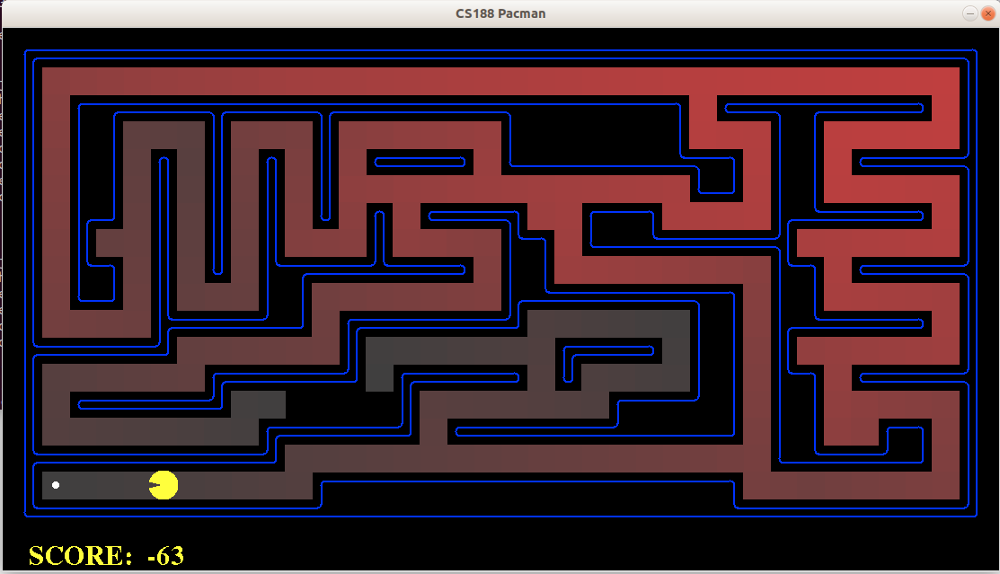

CS 188 | Introduction to Artificial Intelligence Fall 2018 - Assignment Solutions
===============

The course website: https://inst.eecs.berkeley.edu/~cs188/fa18//

My own solutions for Cs188
  

## Project list:

### Project1
: BFS, DFS, UCS, A-star, heuristics

  
  
 

### Project2
: Reflex, Minimax, Alpha-beta Pruning, Expectimax

  
  
 

### Project3
: Prioritized Sweeping Value Iteration, Q-learning, Approximate Q-learning

  
  
  
 

### Project4
: Hidden Markov Model, Bayesian Network, Particle filtering

  
  
 
